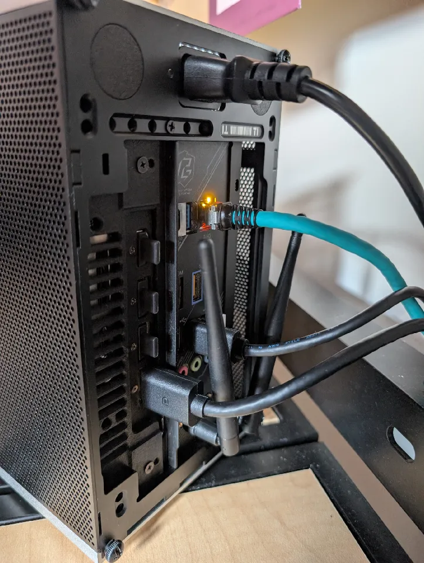
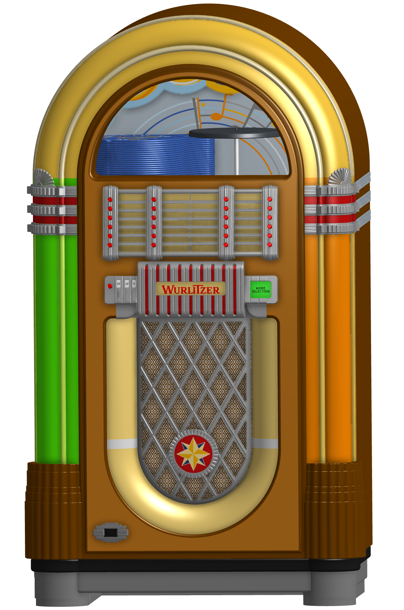
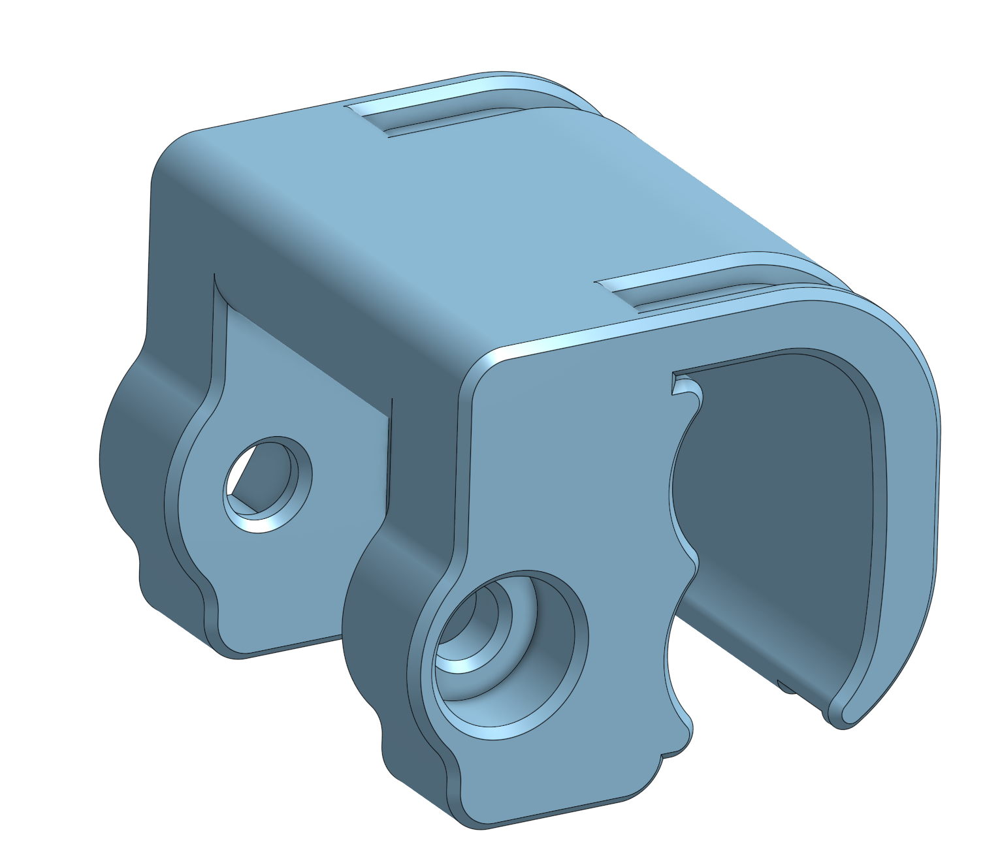
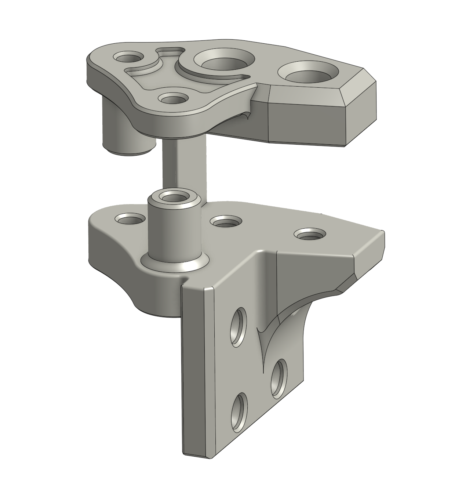
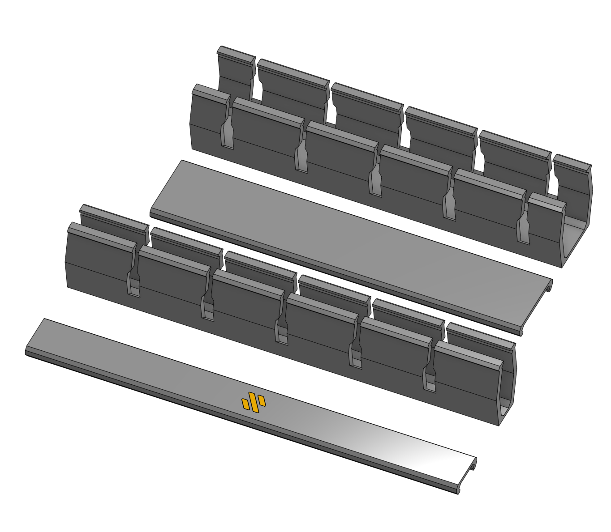
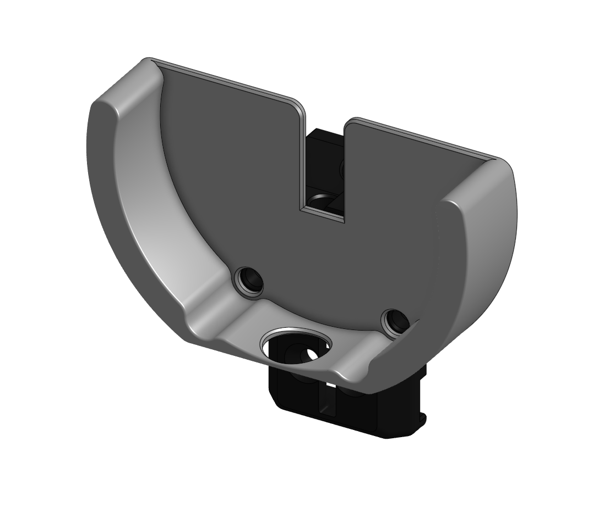

# Mechanical projects and drafting

These are selected examples of my CAD and hands-on work. I distinguish original designs from modifications of existing models and from exercises based on supplied drawings.

## Original designs

### FormD T1 travel kit for the Zotac RTX 5070 SOLID

I designed, printed, and installed a support for my graphics card in a FormD T1 case. The design is my own and was inspired by FormD's metal travel kits for other GPUs. The [Printables listing](https://www.printables.com/model/1615637-formd-t1-travel-kit-for-zotac-rtx-5070-solid) has the model files and photos of the installed part.

### Jukebox

I modeled a decorative jukebox entirely in CAD. It is a complex digital modeling project.

### Bike tail light mount

I designed and 3D printed a mount to solve a problem with my bike's tail light.

## 3D printer modifications and fabrication

### Pin mod joints

I modified an existing pin mod to replace the printer's stock M3 bolts with pins and accommodate my carbon-fiber crossbeam and larger toothed pulleys.

### Wiring channels

I resized existing channel designs to fit the available space and added a color Voron logo.

### Dial indicator mount

I made and used a mount that attaches to the original rail attachment so I can measure the printer bed with a dial indicator.

### Aluminum toolhead adapter

I machined a small adapter for my 3D printer's toolhead. It was used for a period and I still have the physical part.

## SkillsUSA Technical Drafting — 2023

I earned the bronze medal at the Michigan SkillsUSA State Championships. The site reports there were 17 high-school competitors in Technical Drafting; the challenge was to model a Rabbit corkscrew and create drawings so it could be manufactured. The event was timed, and competitors were not expected to finish the entire drawing set. The included 2023 PDF is my unfinished competition submission. [Competition results and project context](https://sites.google.com/salineschools.org/mrvasiloff/home#h.9kktn9fiwssq).

## Mechanical drafting

These SkillsUSA drawing sets show part detailing and assembly documentation; they are not original product designs. The 2023 set is the timed competition submission described above, so its unfinished state reflects the event expectations.

- [2018 SkillsUSA drawing set (PDF)](../assets/skillsusa-2018-drawing-set.pdf)
- [2023 SkillsUSA drawing set (PDF)](../assets/skillsusa-2023-drawing-set.pdf)
